A feature-rich Discord bot built with Python and discord.py, featuring AI chat, music, moderation, utilities, and more!

## 🚀 Features


- 🤖 AI-powered chat and responses
- 🎵 High-quality music playback
- ⚙️ Powerful moderation tools
- ⏰ Reminders and scheduling
- 📊 Server statistics and leaderboards
- 🌤️ Weather information
- 📰 Latest news updates
- 💰 Cryptocurrency prices
- And much more!
### Important Note for Project Setup

When working on the project, ensure that the `ffmpeg.exe` file is located in the following directory:

```
C:\Users\ASUS\OneDrive\Documents\discord_prj\ffmpeg\bin\ffmpeg.exe
```

**Key Point:**
- The project will function correctly only if `ffmpeg.exe` is present in the specified directory. Please verify its existence before running any project-related tasks.

## 📜 Command List

### 🤖 AI Commands
- `!ask [question]` - Ask the AI a question
  - Example: `!ask What's the weather like in Tokyo?`
  - Example: `!ask How do I fix a Python syntax error?`
- `!ai [question]` - Alias for !ask
  - Example: `!ai Tell me a joke about programming`
- `!model` - View available AI models
  - Example: `!model`
- `!model [model_name]` - Change the AI model
  - Example: `!model llama-3.1-70b-versatile`
- `!checkkey` - Check if the Groq API key is valid
  - Example: `!checkkey`
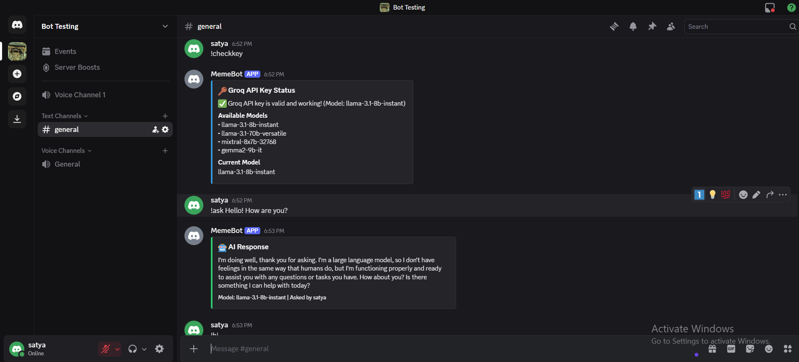

### 🎵 Music Commands
- `!play [query]` - Play music
  - Example: `!play https://youtu.be/dQw4w9WgXcQ`
  - Example: `!play never gonna give you up`
- `!skip` - Skip current song
- `!stop` - Stop music
- `!pause` - Pause playback
- `!resume` - Resume playback
- `!queue` - Show song queue
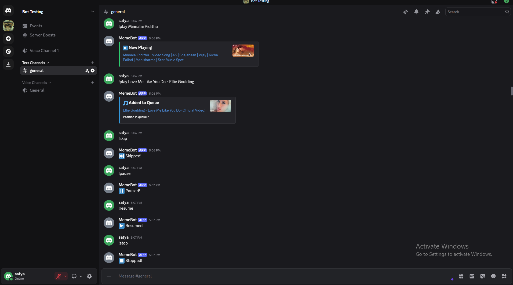

### ⚙️ Moderation
- `!kick @user [reason]` - Kick a user
  - Example: `!kick @User Spamming chat`
- `!ban @user [reason]` - Ban a user
  - Example: `!ban @User Sharing NSFW content`
- `!timeout @user [duration] [reason]` - Timeout
  - Example: `!timeout @User 1h Being rude`
- `!purge [amount]` - Delete messages
  - Example: `!purge 20`
- `!warn @user [reason]` - Warn a user
  - Example: `!warn @User Please keep chat civil`


### 🛠️ Utility Commands
   ## 🌤️ Weather Commands
- `!weather [location]` - Get weather information
  - Example: `!weather New York`
  - Example: `!weather london uk`
  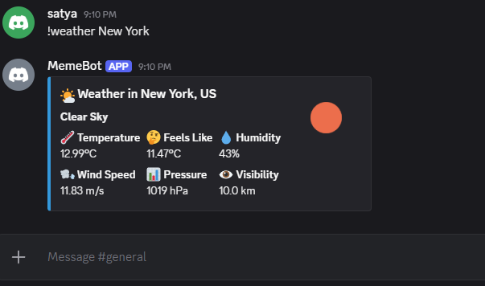
   
   ## ⏰ Reminder Commands
   - `!remind [time] [message]` - Set a reminder
   - Example: `!remind 2h Take a break!`
   - Example: `!remind 1h 30m check email`
   - `!reminders` - View your active reminders
   - Example: `!reminders`
   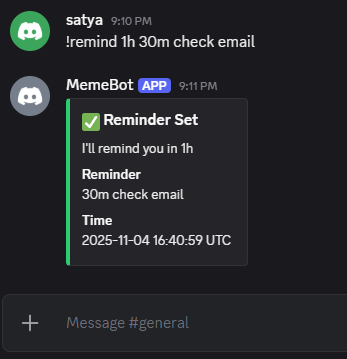

   ## 📰 News Commands
- `!news [category] [limit]` - Get latest news
  - Example: `!news technology 5`
  - Example: `!news business`
- `!newssearch [query]` - Search news
  - Example: `!newssearch artificial intelligence`
  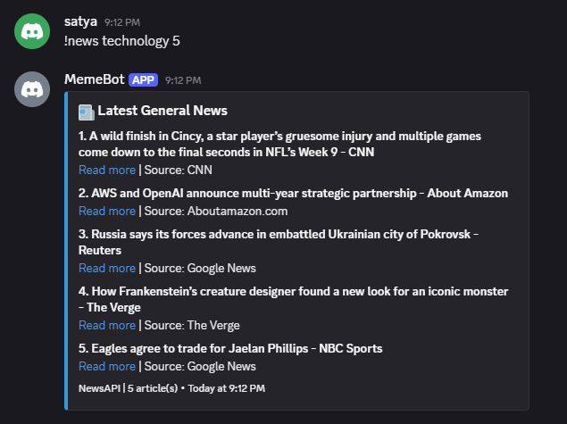

   ## 🎉 Reaction Commands
- `!react [emoji] [message_id]` - Add a reaction (Moderator)
  - Example: `!react 👍 123456789012345678`
  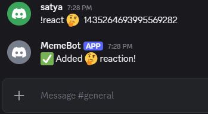

   ## 📊 Poll Commands
   - `!poll "Question?" Option1 Option2` - Create a poll
   - Example: `!poll "Best programming language?" Python JavaScript "C++" Java`
   - `!quickpoll "Question?"` - Quick yes/no poll
   - Example: `!quickpoll "Should we add more features?"`
   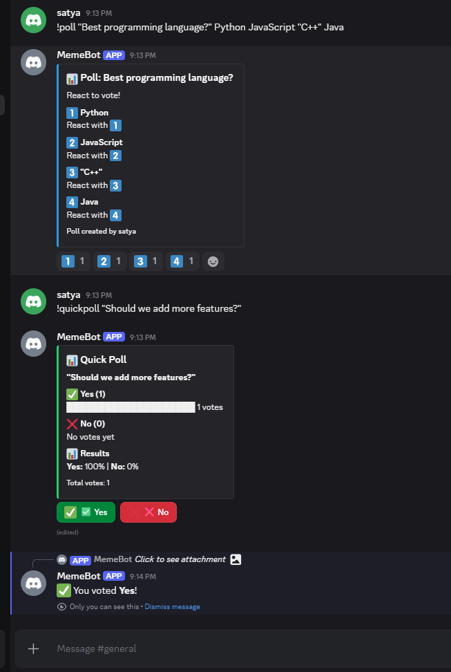
`  
   ## 📝 Logger Commands
- `!setlogchannel #channel` - Set log channel
  - Example: `!setlogchannel #mod-logs`
  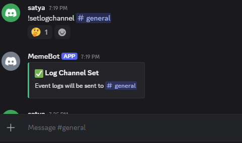

   ## 💰 Crypto Commands
   - `!crypto [coin] [currency]` - Get crypto price
   - Example: `!crypto bitcoin usd`
   - Example: `!price ethereum eur`
   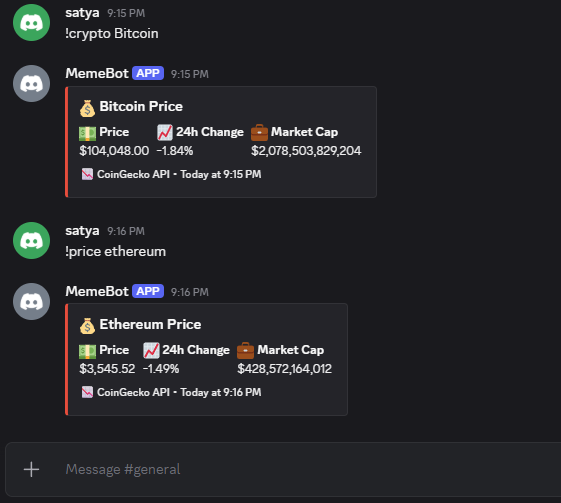


- `!news [category]` - Latest news
- `!crypto [coin] [currency]` - Crypto prices
- `!serverinfo` - Server information
- `!userinfo [@user]` - User information

  


### 📊 Statistics
- `!stats [@user]` - View user statistics
  - Example: `!stats @User`
  - Example: `!stats` (shows your stats)
- `!leaderboard [metric]` - View server leaderboard
  - Example: `!leaderboard messages`
  - Example: `!top activity`
  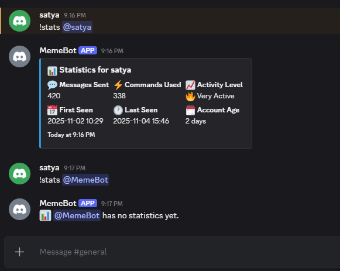

## 🔄 System Commands
- `!ping` - Check bot latency
- `!invite` - Get bot invite link
- `!reload` - Reload cogs (Owner only)
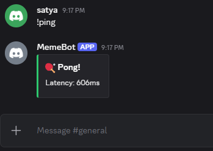

### Command Notes:
- `[required]` - Required parameter
- `(optional)` - Optional parameter
- Use quotes for multi-word parameters
- Most commands work in both DMs and servers
- Some commands require specific permissions

### Common Time Formats:
- `30s` - 30 seconds
- `5m` - 5 minutes
- `2h` - 2 hours
- `1d` - 1 day
- `1w` - 1 week

## 🛠️ Setup

1. Clone the repository:
   ```bash
   git clone https://github.com/yourusername/discord-bot.git
   cd discord-bot


  **BY: AYINALA DHORASATYAMURTHY**
  **E-Mail: Dhorasatyamurthyayinala@gmail.com**
